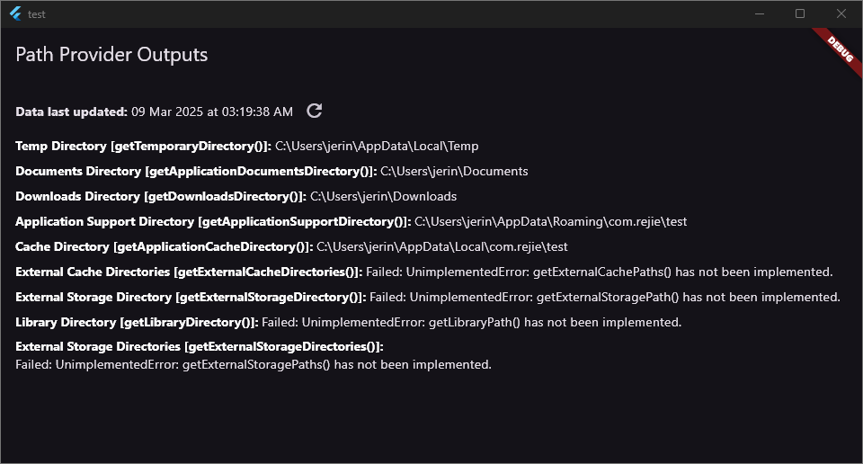

# Path Provider Outputs

## Overview

This Flutter application demonstrates the use of the `path_provider` package to retrieve various directory paths on different platforms.

Plaforms: iOS, Android, macOS, Windows, Linux

## Features

* Retrieves and displays directory paths on different platforms (iOS, Android, macOS, Windows, Linux, and web (not supported, shows error))
* Uses the `path_provider` package to access common directories
* Displays the paths in a user-friendly format using Text and SelectableText widgets

## Directory Paths

The app displays the paths of the following directories:

* Temp Directory
* Documents Directory
* Downloads Directory
* Application Support Directory
* Cache Directory
* External Cache Directories
* External Storage Directories
* Library Directory

## How it Works

The app uses the `path_provider` package to retrieve the directory paths. The `path_provider` package provides a platform-agnostic way to access common directories.

The app uses the following functions to retrieve the directory paths:

* `getTemporaryDirectory()`: Retrieves the path of the temporary directory
* `getApplicationDocumentsDirectory()`: Retrieves the path of the documents directory
* `getDownloadsDirectory()`: Retrieves the path of the downloads directory
* `getApplicationSupportDirectory()`: Retrieves the path of the application support directory
* `getApplicationCacheDirectory()`: Retrieves the path of the cache directory
* `getExternalCacheDirectories()`: Retrieves the paths of the external cache directories
* `getExternalStorageDirectories()`: Retrieves the paths of the external storage directories
* `getLibraryDirectory()`: Retrieves the path of the library directory

The app then displays the retrieved directory paths in a user-friendly format using Text and SelectableText widgets.

## Usage

To run the app, follow these steps:

1. Clone the repository and navigate to the project directory.
2. Run 
    ```
    flutter pub get
    ```
    to retrieve the dependencies.

3. Run 
    ```
    flutter pub get
    ``` 
    to launch the app on a simulator or physical device.

## Note

Last tested on Flutter (Channel stable, ***3.29.1***) with `path_provider` (***2.1.5***)

This app is for demonstration purposes only and does not perform any actual file operations.

This code is extended/modified from the [path_provider_windows](https://pub.dev/packages/path_provider_windows) example.

## Outputs

### Web

Currently, not supported. Will mostly throw `MissingPluginException` or `Unsupported operation: Platform._operatingSystem`

### Windows



### Linux

*Soon*

### macOS

*Soon*

### iOS

*Soon*

### Android

*Soon*
